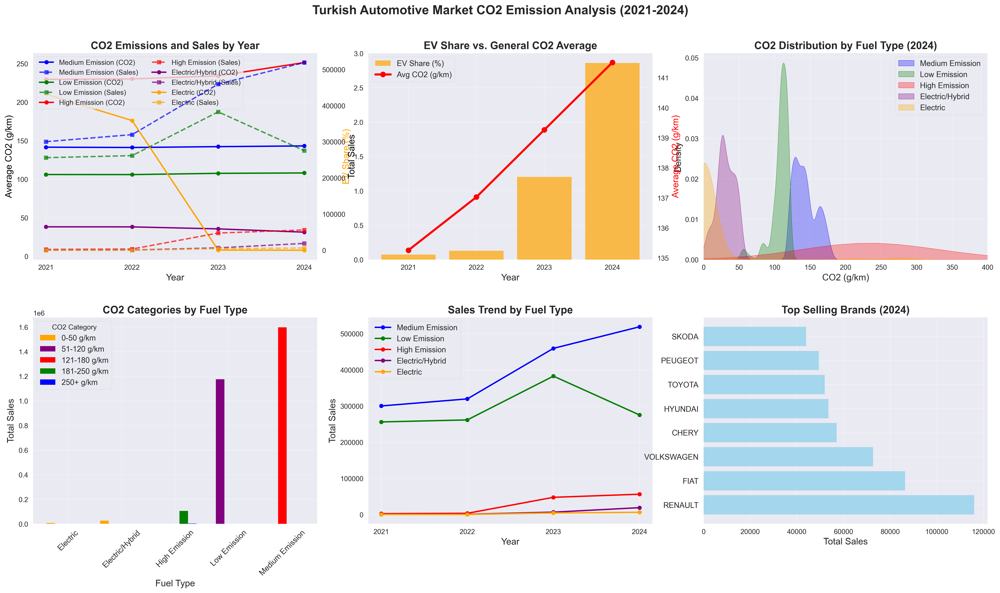

# Turkish Automotive Market CO2 Emission Analysis (2021-2024)

## Summary & Insights

This report presents a comprehensive analysis of CO2 emissions and sales trends in the Turkish automotive market from 2021 to 2024, based on official registration and emission data. The dashboard above visualizes key findings across fuel types, emission categories, and top brands.

### 1. CO2 Emissions and Sales by Year (Top Left)
- **Solid lines** show the average CO2 emissions (g/km) for each fuel type over the years.
- **Dashed lines** represent total sales for each fuel type.
- **Findings:**
  - Medium and low emission vehicles dominate the market in both sales and emission averages.
  - Electric and electric/hybrid vehicles show a clear upward sales trend, though their share is still relatively small compared to internal combustion engine vehicles.
  - High emission vehicles have a much lower sales volume and their average CO2 remains high.

### 2. EV Share vs. General CO2 Average (Top Middle)
- **Green bars**: Share of electric vehicles (EV) in total sales (%).
- **Red line**: Overall average CO2 emissions for all vehicles.
- **Findings:**
  - The share of EVs in total sales increased from 0.07% in 2021 to 2.86% in 2024.
  - Despite the rise in EVs, the average CO2 emissions have only slightly decreased, indicating the continued dominance of internal combustion vehicles.

### 3. CO2 Distribution by Fuel Type (2024, Top Right)
- **Density plots** show the distribution of CO2 emissions for each fuel type in 2024.
- **Findings:**
  - Electric and electric/hybrid vehicles cluster at the lowest CO2 values (close to zero).
  - Medium and low emission vehicles have a wide but lower CO2 range, while high emission vehicles are clearly separated at higher values.

### 4. CO2 Categories by Fuel Type (Bottom Left)
- **Bar chart** of total sales by CO2 emission category and fuel type.
- **Findings:**
  - The majority of sales are in the 101-150 g/km (medium emission) and 51-120 g/km (low emission) categories.
  - Electric and electric/hybrid vehicles are concentrated in the lowest emission categories.

### 5. Sales Trend by Fuel Type (Bottom Middle)
- **Line chart** of total sales for each fuel type over the years.
- **Findings:**
  - Medium and low emission vehicles consistently lead in sales.
  - Electric and electric/hybrid vehicles show rapid growth, especially after 2022.

### 6. Top Selling Brands (2024, Bottom Right)
- **Horizontal bar chart** of the top 8 brands by total sales in 2024.
- **Findings:**
  - Renault, Fiat, and Volkswagen are the top-selling brands.
  - The top brands are primarily those with strong offerings in the low and medium emission segments.

## Conclusion
- The Turkish automotive market is gradually transitioning towards lower emission vehicles, with electric and hybrid vehicles gaining momentum.
- However, internal combustion engine vehicles (especially medium and low emission) still dominate both sales and the overall CO2 profile.
- Policy incentives and infrastructure improvements could further accelerate the adoption of electric vehicles and reduce average emissions in the coming years. 